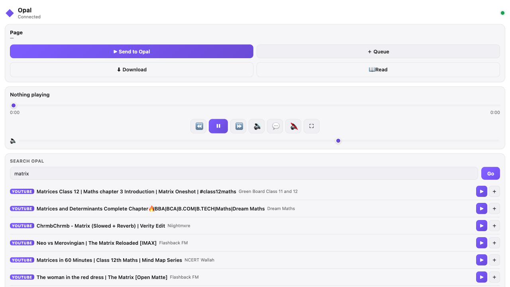

<div align="center">
  

  # Opal

  ### Play everything. From one app.

  **A free, open-source, local-first media player + browser.** Search and stream
  movies, TV, anime, **live TV / IPTV**, YouTube, torrents, and manga — plus your
  own **Jellyfin & Plex** — with a private, on-device **AI copilot**. One native
  binary; no accounts, no cloud, no subscription.

  <p>
    <a href="../../actions/workflows/ci.yml"></a>
    <a href="../../releases"></a>
    <a href="../../releases"></a>
    <a href="../../stargazers"></a>
    <a href="LICENSE"></a>
    
    
  </p>

  <p>
    <a href="#get-it"><b>Get it</b></a> ·
    <a href="#see-it"><b>See it</b></a> ·
    <a href="#the-ai"><b>Why</b></a> ·
    <a href="#under-the-hood"><b>Under the hood</b></a> ·
    <a href="#support"><b>Support Development</b></a>
    (<a href="https://ko-fi.com/debpalash">Ko-fi</a>, <a href="https://paypal.me/palashCoder">PayPal</a>)
  </p>

  
</div>

<br/>

> [!TIP]
> **🔮 New in [v0.5.0](../../releases/tag/v0.5.0)** — a **~40,000-channel Live TV / IPTV** catalog with instant, virtualized search · **Mihon / Tachiyomi manga extensions** (Opal runs the Suwayomi server *for* you — install, browse, and read in-app) · a refined YouTube with **AV1-safe playback**. &nbsp;[See the full release →](../../releases/tag/v0.5.0)

Opal replaces the stack you'd otherwise juggle — a player, a site for the show,
a server front-end, a torrent client, a feed. Say what you want (a title, a
file, a magnet); it searches every source, plays anything, and remembers where
you left off. A local-first app in [Zig](https://ziglang.org) with a
[dvui](https://github.com/david-vanderson/dvui) interface and an **mpv** core —
one native binary, fast and quiet.

<div align="center">

| 🙅 No accounts | 📡 No telemetry | ☁️ No cloud | 💳 No subscription |
|:---:|:---:|:---:|:---:|
| nothing to sign up for | nothing phones home | your history is a SQLite file **you own** | it's your computer |

</div>

<a id="get-it"></a>

## 🚀 Get it

One command — it detects your platform, verifies checksums, and doubles as the
updater (`… -s -- update`) and version pin (`OPAL_VERSION=v0.1.0 …`):

```sh
curl -fsSL https://raw.githubusercontent.com/debpalash/Opal/main/scripts/install.sh | sh
```

Prefer to do it yourself? Find your row — every file is on the
[Releases](../../releases) page:

|  | Platform | Install |
|---|---|---|
| 🍎 | **macOS** (Apple silicon) | open the `.dmg`, drag, done |
| 🍺 | **Homebrew** | `brew install debpalash/tap/opal` |
| 📦 | **Debian / Ubuntu** | `sudo apt install ./opal_*_amd64.deb` |
| 🎩 | **Fedora / openSUSE** | `sudo dnf install ./opal-*.x86_64.rpm` |
| 🏹 | **Arch** | `yay -S opal-bin` (or `opal` to build) |
| 🐧 | **Any Linux** | `chmod +x Opal-*.AppImage` and run it |
| 🪟 | **Windows** (x64) | run the `.msi` — or unzip the portable `.zip` anywhere |
| 🛠 | **From source** | `git clone` → `zig build run` (deps below) |

<sub>🍎 macOS may flag the `.dmg` as **"damaged"** — it isn't; we're not yet
Apple-notarized. Use the one-command installer (no dialog), or run `sudo xattr
-cr /Applications/Opal.app` once after dragging. 🪟 Windows is the newest port —
SmartScreen will want a word. 🍎 Intel Macs: build from source
(`HOMEBREW_PREFIX=/usr/local`).</sub>

**First launch:** open **Settings** (<kbd>⌘</kbd><kbd>,</kbd>) and paste a free
**TMDB v4 token** to light up movie/TV browsing. Voice and AI models are
opt-in downloads — one button each, nothing installs itself.

<details>
<summary><b>🧱 Building from source</b></summary>

<br/>

Zig **0.16.x** plus a handful of native friends:

```sh
brew install zig mpv sqlite onnxruntime sdl2
# plus: libtorrent-rasterbar, g++ (torrent wrapper), ffmpeg/whisper-cpp for voice

git clone https://github.com/debpalash/Opal.git
cd Opal
zig build run        # first build is slow; incrementals are fast
```

**Linux/Wayland:** use `make run` (forces system SDL2 — the bundled one is
X11-only). macOS builds read `HOMEBREW_PREFIX` (default `/opt/homebrew`).

</details>

<details>
<summary><b>🔧 For hackers: dev loops, tests, and the contract</b></summary>

<br/>

- `./dev.sh` — hot-reload loop that survives C changes; `-r` for ReleaseFast.
- `just hot` — native `--watch -fincremental`, millisecond rebuilds.
- `just release` / `just app` — ReleaseFast / macOS `Opal.app` bundle.

```sh
just test-all       # the comprehensive gate — must stay 0 fail
zig build test      # pure-Zig unit tests only (fast)
```

`fail` = real regression. `skip` = optional component not installed. That's
the contract — and every PR reports its tally
(see [`CONTRIBUTING.md`](.github/CONTRIBUTING.md)).

</details>

<details>
<summary><b>📁 Where your stuff lives</b></summary>

<br/>

XDG-compliant:

- `~/.config/opal/` — config, tokens (`0600`), and `opal.db` (history, AI memory)
- `~/.cache/opal/` — caches
- `~/Downloads/opal` — default downloads
- `~/.config/opal/plugins/<name>/` — content plugins (`manifest.json` + a
  `search`/`resolve` executable that prints JSON; Lua runs sandboxed, native
  binaries don't — install only what you trust)

</details>

## 🎯 The goal

Replace the whole stack — streaming apps, server front-ends, trackers, feeds —
with one self-sufficient app. Discovery, curation, memory, and playback live on
your machine and learn your taste without reporting it ([`ROADMAP.md`](ROADMAP.md)).

---

<a id="see-it"></a>

<details open>
<summary><b>✨ The tour, in motion</b></summary>
<br/>

<table>
  <tr>
    <td width="50%" valign="top">
      <br/>
      <b>🧲 Magnets behave like files</b><br/>
      <sub>Press play on a torrent — you're watching while it downloads. <em>(Sintel, © Blender Foundation, CC-BY 3.0)</em></sub>
    </td>
    <td width="50%" valign="top">
      <br/>
      <b>🔭 One search, every source</b><br/>
      <sub>Disk, torrents, Jellyfin, Plex, Stremio, anime, YouTube, live TV, TMDB, manga — one ranked, playable list.</sub>
    </td>
  </tr>
  <tr>
    <td width="50%" valign="top">
      <br/>
      <b>🗺️ Browse every source in one place</b><br/>
      <sub>Trending walls, genres, and episode drill-downs across TMDB, YouTube, anime, Jellyfin, and Plex.</sub>
    </td>
    <td width="50%" valign="top">
      <br/>
      <b>🤖 An AI that lives on your machine</b><br/>
      <sub>Local LLM with tool use answers with playable picks — no API key, no bill, no feed.</sub>
    </td>
  </tr>
</table>

</details>

<a id="the-ai"></a>

## Why?

- 🔭 **Search once, everything answers** — disk, torrents, Jellyfin, Plex, Stremio, anime, YouTube, live TV, TMDB, manga → one ranked, playable list.
- 🧲 **Magnets behave like files** — press play on a torrent and watch while it downloads.
- 📺 **Live TV without the box** — a **~40,000-channel IPTV** catalog with instant, virtualized search.
- 📚 **Manga & comics** — a built-in reader plus **Mihon / Tachiyomi** extensions on a **Suwayomi** server Opal runs for you.
- 🤖 **A local AI copilot** — playable answers to *"what should I watch?"*, hands-free voice, on-disk taste memory. No API key, no cloud.
- ▶️ **A player that sweats the details** — auto subtitles · SponsorBlock · Chromecast · watch-party · phone remote (`:3000`) · session restore.
- 🧰 **…and the drawer** — OCR on video frames · language flashcards · recommendations · history & queue · RSS · incognito · seven themes · JSON API (`:41595`).

## 🆚 One app instead of ten

Opal is a free, open-source alternative to a shelf of separate tools, all
running locally on your hardware:

| Instead of… | Opal gives you |
|---|---|
| **Stremio / Kodi** + a pile of add-ons | one search across every source, a play button on each row |
| **an IPTV / live-TV app** | ~40,000 live channels, searchable as you type |
| **Jellyfin / Plex** web clients | your own media servers, browsed natively |
| **Tachiyomi / Mihon** stuck on your phone | manga extensions on the desktop — server bundled and self-managed |
| **a torrent client** + a player | magnet → instant streaming while it downloads |
| **ChatGPT** for *"what do I watch?"* | a local AI copilot — no key, no bill, no feed |
| **SponsorBlock · subtitle sites · Chromecast apps** | all built in |

## ⌨️ Keyboard-first, remote-friendly

| | | | |
|---|---|---|---|
| <kbd>S</kbd> search | <kbd>B</kbd> browser | <kbd>D</kbd> library | <kbd>H</kbd> history |
| <kbd>F</kbd> fullscreen | <kbd>P</kbd> playlist | <kbd>G</kbd> grid layout | <kbd>Z</kbd> fit/crop |
| <kbd>⌘</kbd><kbd>O</kbd> open file | <kbd>⌘</kbd><kbd>,</kbd> settings | <kbd>Esc</kbd> back out | <kbd>⇧</kbd><kbd>I</kbd> **cheat sheet** |

## 🧩 Browser extension

**Opal Connect** (Chrome / Edge / Firefox, MV3) turns any tab into an Opal
action — send or queue a video, add a manga/novel site as a source, or drive
playback from a side-panel remote: search, queue, transport, cast, watch-party.

<div align="center">
  
</div>

**Install** — download the Chrome/Edge or Firefox build from the
[latest release](../../releases/latest) (unzip → load unpacked), or build from
`extension/` (`npm install && npm run build`). Pair it with your Opal API token
and every action routes to the desktop app. Setup and endpoint reference in
[`extension/README.md`](extension/README.md).

---

<a id="under-the-hood"></a>

## ⚙️ Under the hood

```
src/
├── main.zig     # appFrame() — one function per frame, immediate mode
├── core/        # alloc, state, config, paths, io shim, sqlite (+sqlite-vec)
├── player/      # mpv wrapper, playlists, subtitles, watch history
├── services/    # search, AI, torrents, jellyfin, remote API, ...
└── ui/          # dvui widgets — theme tokens, shell, grid, player chrome
web/             # companion web UI (its own Zig project)
extension/       # Opal Connect — cross-browser MV3 extension (play/read/download/scrape → Opal); see extension/README.md
```

Player, search, torrent streamer, and AI compile to **one native binary**: a
single leak-checked global allocator, fixed-size buffers over heap churn, one
`state.app` hub under strict thread-safety rules, and a render loop that
repaints only on change. House rules in
[`CONTRIBUTING.md`](.github/CONTRIBUTING.md).

Content sources ship **off**: the core has no sources configured and nothing
enables itself — you explicitly install endpoints from the plugin registry,
and you can un-install them just as fast
([`CONTENT_POLICY.md`](docs/CONTENT_POLICY.md)).

<a id="support"></a>

## 💜 Support development

No telemetry to monetize, no accounts to upsell — Opal runs on goodwill:

- ☕ **[Ko-fi](https://ko-fi.com/debpalash)** or 💸 **[PayPal](https://paypal.me/palashCoder)** — keep the release cadence (and the coffee) going.
- ⭐ **Star the repo** — it's how people find it.
- 🐛 **File good bugs** ([how](.github/SUPPORT.md)) · 🔧 **send PRs** ([how](.github/CONTRIBUTING.md)).
- 📣 **Show someone** — the GIFs above are yours to share.

## 🤝 Contributing

Yes please — read [`CONTRIBUTING.md`](.github/CONTRIBUTING.md) and the
[`CODE_OF_CONDUCT.md`](.github/CODE_OF_CONDUCT.md), run `just test-all`, and report the
tally in your PR. Questions live in [Discussions](../../discussions);
the full help map is in [`SUPPORT.md`](.github/SUPPORT.md).

## 📜 License

**GPL-3.0** (see [`LICENSE`](LICENSE), [`NOTICE.md`](docs/NOTICE.md)) — the honest
choice for a program linked against libmpv. Bundled dependencies keep their own
licenses (libtorrent BSD, dvui/ONNX MIT, SDL2 zlib, SQLite public domain).

## The fine print

> **Opal is a player and an aggregator — it hosts, indexes, and distributes
> nothing.** It connects to sources *you* configure. Only access media you have
> the legal right to access in your jurisdiction; read
> [`CONTENT_POLICY.md`](docs/CONTENT_POLICY.md) before enabling content plugins or
> torrent features. BitTorrent exposes your IP to the swarm — use a VPN if that
> matters to you. Rights holders: see [`docs/DMCA.md`](docs/DMCA.md) for the takedown
> process.

Provided "as is", no warranty. The authors are not responsible for how the
software is used or for content reached through third-party sources.

<br/>

<div align="center">
  <br/>
  <sub>Built with Zig, mpv, and dvui.</sub>

  <br/><br/>
  <sub>
  <b>Opal</b> — open-source media player · IPTV / live TV player · torrent streaming ·
  Jellyfin & Plex client · YouTube desktop app · manga reader (Mihon / Tachiyomi / Suwayomi) ·
  local AI copilot · self-hosted Stremio & Kodi alternative · for macOS, Linux, and Windows.
  </sub>
</div>
