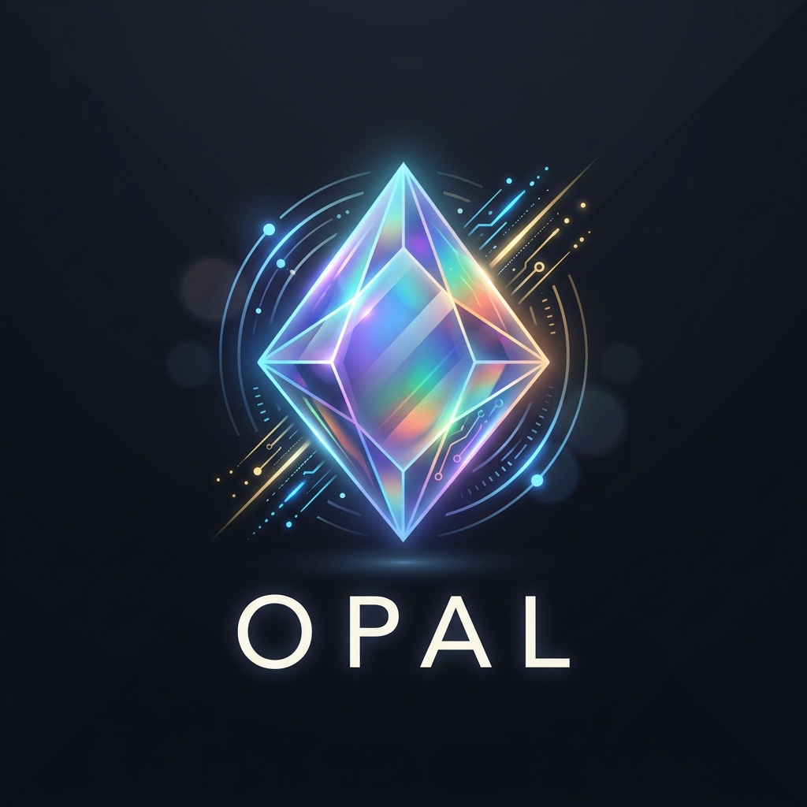

<div align="center">
  

  # Opal

  **Play everything.**

  _The blazing-fast, decentralized, local-first intelligent media runtime._
</div>

---

Opal is a native, local-first desktop media app written in **Zig (0.16.x)** with an
immediate-mode [dvui](https://github.com/david-vanderson/dvui) GUI. It unifies media
playback (libmpv), peer-to-peer torrent streaming (libtorrent), TMDB / anime / comics
browsing, Jellyfin libraries, YouTube, and a universal cross-source search into a single
fast binary. On top of that it layers a local AI assistant with voice (STT/TTS), local
LLM chat, ONNX OCR, and sqlite-vec vector memory, plus a JSON remote-control API and a
companion web UI.

It is **local-first with no telemetry** — watch history and AI memory live in a local
SQLite database, and your tokens live in your config directory. Nothing phones home.

---

## ✨ Features

### ▶️ Play
- **mpv-backed playback** for video and audio with subtitles, auto-subs, and scripts
  (SponsorBlock, thumbfast, autoload).
- **Split-screen multi-player** and session restore — reopen what you were watching.
- **BitTorrent streaming** via libtorrent (magnet + `.torrent`) with piece
  prioritization for near-instant playback, plus a transfers UI (files / active /
  history) with speed limits.
- **Chromecast** casting, **LAN watch-party / co-watch**, and a playback queue.

### 🔭 Discover
- **TMDB** browse and search for movies and TV (requires your own v4 bearer token).
- **Anime** via Jikan (MyAnimeList), AniList, allanime GraphQL, and AnimePahe fallback.
- **Comics & manga** reader with a native viewer (plugin-driven sources).
- **Jellyfin** client: login, libraries, browse / search, video and audio streaming.
- **YouTube** search and playback via Piped instances with a yt-dlp fallback.
- **Stremio add-on protocol** support (Torrentio, MediaFusion, Comet, and friends).
- **RSS feeds**, recommendations, and taste vectors.

### 🔍 Search
- **Universal resolver:** one query, ranked across Jellyfin → Stremio add-ons →
  torrents → anime → YouTube → local files → TMDB → comics.
- **Torrent indexer search** through a bundled qBittorrent-style Python engine harness.

### 🗂️ Organize
- Local **watch history**, **search history**, and **download history**.
- **Recommendations**, scene / spoiler memory, and per-source continue-watching.
- Everything stored in one local SQLite DB — no accounts, no cloud sync required.

### 🤖 AI & Voice
- **Local LLM chat** (llama-server / Gemma GGUF) with tool use (TMDB search,
  `read_webpage` via Jina) and cross-session conversation memory.
- **sqlite-vec** 768-dim embeddings for AI memory vector search.
- **Voice:** STT (whisper-cli / faster-whisper / sherpa), TTS (macOS `say` / Piper /
  Kokoro / KittenTTS), and continuous VAD hands-free conversation with barge-in.
- **Frame OCR** via an ONNX PP-OCR pipeline, live ASR, and a language-learning server.

### 🌐 Remote & Web
- **JSON remote API** on `:41595` (bearer-token auth) for external automation.
- **Companion web UI** on `:3000` (an independent Zig project under `web/`).

---

## 📸 Screenshots

> _Screenshots coming soon._ Drop images in `assets/` and reference them here.

---

## 🛠️ Install & Build

**Requirements:** Zig **0.16.x** (macOS toolchain `/opt/homebrew/bin/zig`).

Install the native dependencies:

```sh
brew install zig mpv sqlite onnxruntime sdl2
# plus: libtorrent-rasterbar, g++ (for the C++ torrent wrapper),
#       and ffmpeg / whisper-cpp for voice features
```

Build and run:

```sh
zig build run                      # debug build + launch (slow first build, fast incremental)
./dev.sh                           # fswatch HMR loop — survives C / build.zig changes
                                   #   flags: -r ReleaseFast, -v verbose, -- <args> passthrough
just hot                           # native Zig 0.16 incremental --watch (millisecond rebuilds)
just release                       # == zig build -Doptimize=ReleaseFast
```

**Platform notes:**
- The **macOS** build hard-codes `/opt/homebrew/{lib,include}`.
- On **Linux / Wayland**, use `make run` (forces `-fsys=sdl2` + `SDL_VIDEODRIVER=wayland`);
  the bundled SDL2 is X11-only.
- Build options: `-Dheadless`, `-fsys=sdl2`.
- macOS bundling: `just app` / `just app-run` (builds `Opal.app` via
  `scripts/build-app.sh`), `just menubar`.

---

## 🚀 Quick start

```sh
git clone https://github.com/debpalash/Opal.git
cd Opal
zig build run
```

On first launch, open **Settings** and add your **TMDB v4 bearer token** to enable
movie/TV browsing. Optional model downloads (Whisper, sherpa, Gemma GGUF) are opt-in
via Settings buttons.

---

## 🧪 Testing

```sh
just test-all       # == python3 tests/test_features.py — the comprehensive gate
                    #   (DB schema, config, theming, voice/ASR + folds in zig unit tests)
                    #   writes tests/results.json (viewable in tests/dashboard.html)
zig build test      # == just test — pure-Zig unit modules only (fast, no app build)
```

A `fail` is a real regression; a `skip` means an optional component (voice ML deps, a
running server) isn't present. Run the suite after any feature change and report the
pass/fail tally.

---

## ⚙️ Configuration

Opal is **XDG-compliant**:

- **Config:** `~/.config/opal/` — `config.tsv`, your TMDB token, plus optional
  OpenSubtitles / Jellyfin / Trakt / AniList / SIMKL keys and `api.token` (mode `0600`).
- **Cache:** `~/.cache/opal/`
- **Database:** `~/.config/opal/opal.db` (watch history, AI memory, caches).
- **Downloads:** default `~/Downloads/opal`.

Never hard-code paths — Opal resolves everything through `src/core/paths.zig`.

---

## 🧩 Plugins

Opal ships clean: the core app contains no scraping code. Content sources are provided by
**external, user-installed plugins** under `~/.config/opal/plugins/<name>/`. Each plugin
has a `manifest.json` and language-agnostic executables (`search`, `resolve`, optional
`trending`) that emit JSON on stdout. Lua scripts run under a sandbox prelude that nils
dangerous globals unless the manifest opts into `allow_unsafe`; **native binaries and
non-Lua interpreters bypass the sandbox**, so only install plugins you trust. See the
[content & plugin policy](CONTENT_POLICY.md) for trust-model details.

---

## 🏗️ Architecture

```
src/
├── main.zig          # appFrame() — single-frame entry, dvui immediate-mode loop
├── core/             # alloc, state, config, logs, paths, sync, io_global, db
├── player/           # mpv wrapper, playlist, m3u, subtitles, watch_history
├── services/         # browser, search, AI, scrapers, transfers, jellyfin, remote API, ...
└── ui/               # dvui widgets — ui.zig is the frame root, then drawer/header/footer/grid/...
web/                  # separate Zig project — web UI on :3000, talks to remote API on :41595
```

Key conventions: a single global allocator (`src/core/alloc.zig`), fixed-size buffers
instead of slices in state structs, a process-wide threaded `Io` shim
(`src/core/io_global.zig`) for Zig 0.16, and a single global `state.app` hub. See
[`CLAUDE.md`](CLAUDE.md) for the full set.

---

## 🤝 Contributing

Contributions are welcome! Please read [`CONTRIBUTING.md`](CONTRIBUTING.md) and the
[`CODE_OF_CONDUCT.md`](CODE_OF_CONDUCT.md) before opening a pull request. Run
`just test-all` and report the pass/fail tally with your changes.

---

## 📄 License

Opal is released under the **GNU General Public License v3.0 (GPL-3.0)** — see
[`LICENSE`](LICENSE) and [`NOTICE.md`](NOTICE.md) for third-party components and their
licenses. The copyleft choice is driven by Opal's linkage against **libmpv** (commonly
distributed under the GPL); a permissive license for the combined work would not be
defensible. Third-party native dependencies retain their own licenses (libtorrent: BSD;
dvui / ONNX Runtime: MIT; SDL2: zlib; SQLite: public domain).

---

## ⚖️ Legal & responsible use

> **Opal is a media _player_ and _aggregator_ — it hosts, indexes, and distributes no
> content of its own.** It connects to third-party sources that you configure or install.
> You are responsible for how you use it. **Only access media you have the legal right to
> access** in your jurisdiction. Please read [`CONTENT_POLICY.md`](CONTENT_POLICY.md)
> before enabling content-source plugins or torrent features.

BitTorrent features join the public DHT and swarm, which exposes your IP address to other
peers. Use a VPN or other appropriate measures if that matters to you.

---

## Disclaimer

This software is provided "as is", without warranty of any kind. The authors and
contributors are not responsible for how the software is used, nor for any content
accessed through third-party sources, plugins, or indexers. Use at your own risk and in
compliance with the laws of your jurisdiction.
