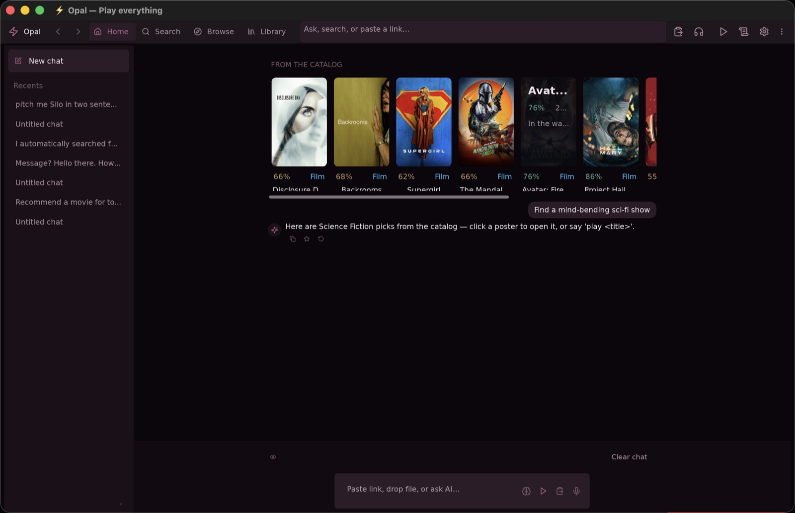
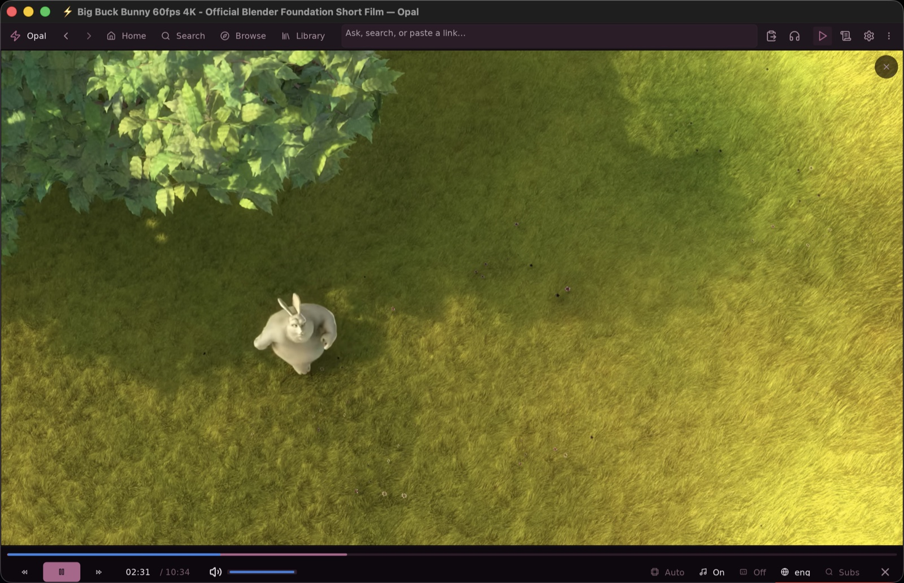

<div align="center">
  

  # Opal

  ### Play everything.

  _The media player, evolved: one interface that finds, curates, and plays
  whatever you're in the mood for — with an AI that never leaves your machine._

  <p>
    <a href="https://github.com/debpalash/Opal/actions/workflows/ci.yml"></a>
    <a href="../../releases"></a>
    <a href="LICENSE"></a>
    
    
  </p>

  <p>
    <a href="#get-it"><b>Get it</b></a> ·
    <a href="#see-it"><b>See it</b></a> ·
    <a href="#the-ai"><b>The AI</b></a> ·
    <a href="#under-the-hood"><b>Under the hood</b></a> ·
    <a href="#support"><b>Support Development</b></a>
    (<a href="https://ko-fi.com/debpalash">Ko-fi</a>, <a href="https://paypal.me/palashCoder">PayPal</a>)
  </p>

  
  <sub><em>It's late. Opal knows it's late.</em></sub>
</div>

<br/>

> **It's 11 PM and you just want to watch something.** So why are there nine
> tabs open? A player for the files. A site for the show. An app for the
> server. A wiki for "what episode was that." A feed deciding what you see
> next. Opal's whole thesis is that this is *one job*: you say what you're in
> the mood for — a title, a file, a magnet, a vibe — and a moment later you're
> watching it. That's it. That's the app.

For decades the "media player" has been the dumb end of the pipeline — the
thing other apps hand a file to. Opal is what comes after: **the place where
watching *starts***. It searches everywhere at once, curates to your taste,
remembers where you left off, and plays anything — a local-first media app
written in [Zig](https://ziglang.org), with an immediate-mode
[dvui](https://github.com/david-vanderson/dvui) interface and an **mpv**
heart. It opens in a blink, idles in silence, and quits with a receipt:
`Clean shutdown: 0 memory leaks.`

<div align="center">

| 🙅 No accounts | 📡 No telemetry | ☁️ No cloud | 💳 No subscription |
|:---:|:---:|:---:|:---:|
| nothing to sign up for | nothing phones home | your history is a SQLite file **you own** | it's your computer |

</div>

## 🎯 The goal

**Become the true alternative to the whole stack** — the streaming apps, the
server front-ends, the trackers, the recommendation feeds — by being
**self-sufficient**: one interface that understands what you need and quietly
takes care of it, powered by an AI that runs on *your* hardware and answers to
*you*.

A media system shouldn't need a corporation attached. Discovery, curation,
memory, playback — Opal's bet is that all of it can live on your machine,
learn your taste without reporting it, and get out of the way. Every release
walks further in that direction ([`ROADMAP.md`](ROADMAP.md)).

---

<a id="see-it"></a>

## 🧲 Press play on a torrent. Just… play.

The party trick: **magnets behave like files.** libtorrent piece-prioritization
fetches the beginning first, so you press play and you're *watching* while the
rest downloads. No staging folder, no "check back in an hour."


<sub>Sintel, © Blender Foundation, CC-BY 3.0 — demoed with openly licensed film, as intended.</sub>

## 🔭 Search once. Everything answers.

One query fans out — in parallel — across your disk, torrents, Jellyfin,
Stremio add-ons, anime, YouTube, TMDB, comics — and comes back as **one ranked
list** with a play button on every row. Sort by relevance, quality, or seeds.


## 🗺️ Browse like a streaming service you actually own

Trending walls, genres, seasons-and-episodes drill-downs — for movies & TV,
YouTube, anime, comics, RSS, your Jellyfin and Plex libraries, even the open
web. One tab bar, zero franchises acquired.


<a id="the-ai"></a>

## 🤖 An AI that lives in your machine — and nowhere else

Ask the box at the top anything: *"what should I watch tonight if I loved
Interstellar?"* A **local LLM** answers with playable picks — it can search
your sources, queue things up, and see what's playing. Talk to it hands-free
(Whisper ears, Piper/Kokoro voice, barge-in interruptions). It remembers your
taste in a vector memory (`sqlite-vec`) that never leaves your disk.

No API key. No monthly bill. No "your conversations help us improve."




## ▶️ A player that sweats the details

mpv underneath; care on top:


<sub>Big Buck Bunny, © Blender Foundation, CC-BY 3.0</sub>

- **Subtitles three ways** — embedded, fetched, or *generated on the spot* by Whisper.
- **SponsorBlock** skips the "smash that like button" for you.
- **Watch party** over LAN, **Chromecast** to the TV, and a phone-friendly
  **web remote** (`:3000`) for couch operations.
- **Session restore** — quit mid-episode, resume mid-sentence.
- Fullscreen chrome that gets out of the way and comes back when your mouse does.

## …and the rest of the drawer

Comics & manga reader · live OCR on video frames (PP-OCR, for reading signs in
anime) · language-learning mode with subtitle flashcards · taste-based
recommendations · watch/search/download history · queue · RSS · incognito mode
(<kbd>I</kbd>, for research) · seven themes · a JSON API on `:41595` for your
own automations.

## ⌨️ Keyboard-first, remote-friendly

| | | | |
|---|---|---|---|
| <kbd>S</kbd> search | <kbd>B</kbd> browser | <kbd>D</kbd> library | <kbd>H</kbd> history |
| <kbd>F</kbd> fullscreen | <kbd>P</kbd> playlist | <kbd>G</kbd> grid layout | <kbd>Z</kbd> fit/crop |
| <kbd>⌘</kbd><kbd>O</kbd> open file | <kbd>⌘</kbd><kbd>,</kbd> settings | <kbd>Esc</kbd> backs out of things, politely | <kbd>⇧</kbd><kbd>I</kbd> **the cheat sheet** |

---

<a id="get-it"></a>

## 🚀 Get it

**Grab a build** from [Releases](../../releases) (macOS arm64 `.dmg` / `.app`),
or build from source — you need Zig **0.16.x** and a handful of native friends:

```sh
brew install zig mpv sqlite onnxruntime sdl2
# plus: libtorrent-rasterbar, g++ (torrent wrapper), ffmpeg/whisper-cpp for voice

git clone https://github.com/debpalash/Opal.git
cd Opal
zig build run        # first build is slow; incrementals are fast
```

**First launch:** open **Settings** (<kbd>⌘</kbd><kbd>,</kbd>) and paste a free
**TMDB v4 token** to light up movie/TV browsing. Voice and AI models are
opt-in downloads — one button each, nothing installs itself.

**Linux/Wayland:** use `make run` (forces system SDL2 — the bundled one is
X11-only). macOS builds hard-code `/opt/homebrew/{lib,include}`.

<details>
<summary><b>🔧 For hackers: dev loops, tests, and the contract</b></summary>

<br/>

- `./dev.sh` — hot-reload loop that survives C changes; `-r` for ReleaseFast.
- `just hot` — native `--watch -fincremental`, millisecond rebuilds.
- `just release` / `just app` — ReleaseFast / macOS `Opal.app` bundle.

```sh
just test-all       # the comprehensive gate — must stay 0 fail
zig build test      # pure-Zig unit tests only (fast)
```

`fail` = real regression. `skip` = optional component not installed. That's
the contract — and every PR reports its tally
(see [`CONTRIBUTING.md`](CONTRIBUTING.md)).

</details>

<details>
<summary><b>📁 Where your stuff lives</b></summary>

<br/>

XDG-compliant, no surprises:

- `~/.config/opal/` — config, tokens (`0600`), and `opal.db` (history, AI memory)
- `~/.cache/opal/` — caches
- `~/Downloads/opal` — default downloads
- `~/.config/opal/plugins/<name>/` — content plugins (`manifest.json` + a
  `search`/`resolve` executable that prints JSON; Lua runs sandboxed, native
  binaries don't — install only what you trust)

</details>

<a id="under-the-hood"></a>

## ⚙️ Under the hood

```
src/
├── main.zig     # appFrame() — one function per frame, immediate mode
├── core/        # alloc, state, config, paths, io shim, sqlite (+sqlite-vec)
├── player/      # mpv wrapper, playlists, subtitles, watch history
├── services/    # search, AI, torrents, jellyfin, remote API, ...
└── ui/          # dvui widgets — theme tokens, shell, grid, player chrome
web/             # companion web UI (its own Zig project)
```

The parts we're quietly proud of: the whole system — player, search, torrent
streamer, AI — compiles to **one fast native binary**; **one** global
allocator with leak detection on every exit; fixed-size buffers instead of
heap churn; a single `state.app` hub with disciplined thread-safety rules; a
render loop that repaints **only when something changed** (your fans will
thank us); and a threaded-Io shim for Zig 0.16. House rules in
[`CONTRIBUTING.md`](CONTRIBUTING.md); where this is all going in
[`ROADMAP.md`](ROADMAP.md).

Content sources ship **off**: the core has no sources configured and nothing
enables itself — you explicitly install endpoints from the plugin registry,
and you can un-install them just as fast
([`CONTENT_POLICY.md`](CONTENT_POLICY.md)).

<a id="support"></a>

## 💜 Support development

Opal has no telemetry to monetize and no account system to upsell — it runs on
goodwill:

- ☕ **[Buy the maintainer a coffee on Ko-fi](https://ko-fi.com/debpalash)** or
  💸 **[chip in via PayPal](https://paypal.me/palashCoder)** — donations keep
  the release cadence honest and the coffee supply uninterrupted.
- ⭐ **Star the repo** — it's genuinely how people find it.
- 🐛 **File good bugs** ([how](SUPPORT.md)) · 🔧 **send PRs** ([how](CONTRIBUTING.md)).
- 📣 **Show someone.** This pitch lands best as a 30-second demo — the GIFs
  above are yours to share.

## 🤝 Contributing

Yes please — read [`CONTRIBUTING.md`](CONTRIBUTING.md) and the
[`CODE_OF_CONDUCT.md`](CODE_OF_CONDUCT.md), run `just test-all`, and report the
tally in your PR. Questions live in [Discussions](../../discussions);
the full help map is in [`SUPPORT.md`](SUPPORT.md).

## 📜 License

**GPL-3.0** (see [`LICENSE`](LICENSE), [`NOTICE.md`](NOTICE.md)) — the honest
choice for a program linked against libmpv. Bundled dependencies keep their own
licenses (libtorrent BSD, dvui/ONNX MIT, SDL2 zlib, SQLite public domain).

## The fine print

> **Opal is a player and an aggregator — it hosts, indexes, and distributes
> nothing.** It connects to sources *you* configure. Only access media you have
> the legal right to access in your jurisdiction; read
> [`CONTENT_POLICY.md`](CONTENT_POLICY.md) before enabling content plugins or
> torrent features. BitTorrent exposes your IP to the swarm — use a VPN if that
> matters to you. Rights holders: see [`DMCA.md`](DMCA.md) for the takedown
> process.

Provided "as is", no warranty. The authors are not responsible for how the
software is used or for content reached through third-party sources.

<br/>

<div align="center">
  <br/>
  <sub>Built with Zig, mpv, and an unreasonable number of late nights.<br/>
  <b>Now go watch something.</b></sub>
</div>
