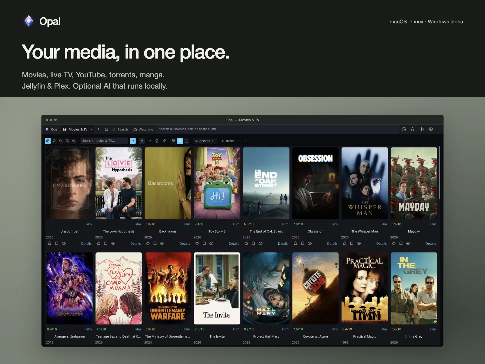
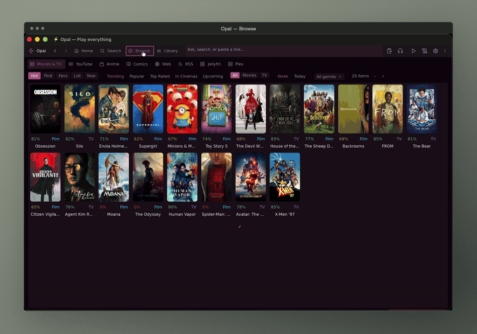
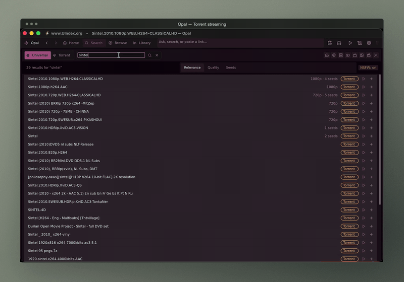
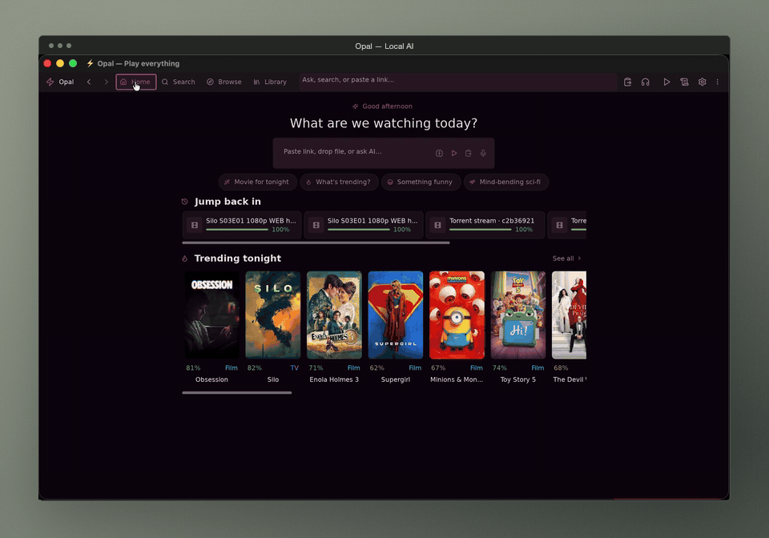
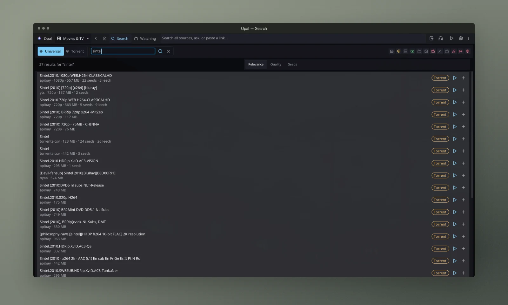
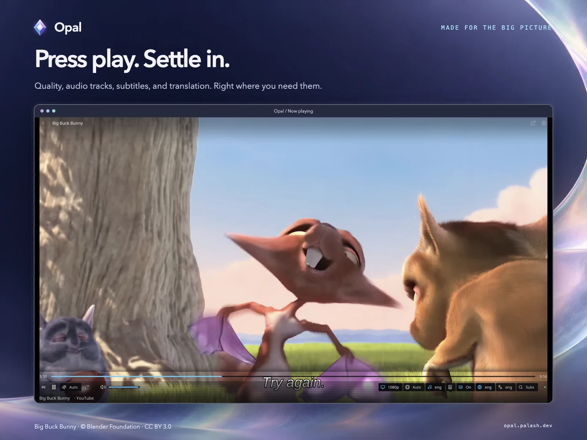
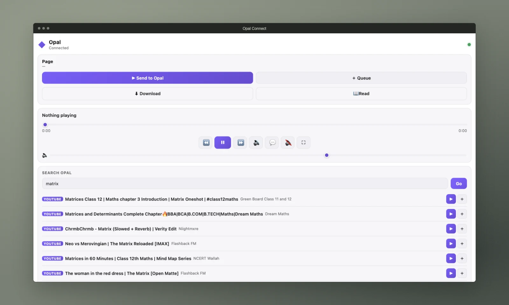

<picture>
  <source media="(max-width: 600px)" srcset="assets/readme/hero-mobile.webp" />
  
</picture>

**[Download Opal →](#get-it)** &nbsp; [Watch the demos](#see-it) &nbsp; [Website ↗](https://opal.palash.dev)

A free, open-source media player and browser. **No telemetry. No subscription.**

<sub>macOS · Linux · Windows alpha &nbsp; / &nbsp; [Features](#why) · [Developers](#building-from-source) · [Support](#support)</sub>

<a id="get-it"></a>

## Get Opal

One command detects your platform and verifies the download. Linux installs to
`~/.local` without `sudo`.

```sh
curl -fsSL https://raw.githubusercontent.com/debpalash/Opal/main/scripts/install.sh | sh
```

[Download a release instead →](../../releases/latest)

<details>
<summary><b>macOS</b> — Apple silicon, Homebrew, Intel builds</summary>

Open the `.dmg` and drag Opal to Applications, or install the self-contained app:

```sh
brew install debpalash/tap/opal
```

For an unnotarized DMG showing “damaged,” use the installer or run:

```sh
sudo xattr -cr /Applications/Opal.app
```

Intel Macs require a source build with `HOMEBREW_PREFIX=/usr/local`.

</details>

<details>
<summary><b>Linux</b> — AppImage, Debian, RPM, Arch</summary>

Standard builds require **glibc 2.38+**. Ubuntu 20.04/22.04, Debian 12, and Mint 21
should use `_compat_amd64.deb` (**glibc 2.31+**); the installer selects it automatically.
Compatibility builds use software decoding and X11/XWayland.
[Compatibility details](packaging/linux-compat/README.md).

**AppImage** also needs system OpenSSL 3 (`libssl.so.3`, `libcrypto.so.3`):

```sh
chmod +x Opal-*.AppImage
./Opal-*.AppImage
```

**Debian / Ubuntu:** use `_compat_amd64.deb` on older hosts. Standard packages
need `libmpv2` and `libtorrent-rasterbar2.0` (Ubuntu 24.04+ / Debian 13+).

```sh
sudo apt install ./opal_<version>_amd64.deb
```

**Fedora:**

```sh
sudo dnf install ./opal-*.x86_64.rpm
```

**openSUSE:**

```sh
sudo zypper install ./opal-*.x86_64.rpm
```

**Arch / Omarchy:** the v0.8.8 AUR binary links libtorrent 2.0. Use AppImage if your
system ships 2.1. [AUR package](https://aur.archlinux.org/packages/opal-media-player-bin).

```sh
yay -S opal-media-player-bin
# or: paru -S opal-media-player-bin
```

Without a helper:

```sh
git clone https://aur.archlinux.org/opal-media-player-bin.git
cd opal-media-player-bin && makepkg -si
```

Release packages also install with `sudo pacman -U ./opal-*-x86_64.pkg.tar.zst`.

</details>

<details>
<summary><b>Windows</b> — x64 alpha</summary>

Install the `.msi` or extract the portable `.zip` from [Releases](../../releases/latest).
Expect bugs and SmartScreen prompts. [Report an issue](../../issues).

</details>

<details>
<summary><b>First launch and updates</b></summary>

Browse **Movies & TV** without a key, or choose **Home** to open a file.
Install search sources in **Settings → General → Install source plugins**.
A **TMDB v4 token** adds richer metadata. AI and voice models are opt-in.
Reopen onboarding in **Settings → About**.

**Update:** rerun the installer with `sh -s -- update`. Set `OPAL_VERSION=vX.Y.Z`
to pin a release. Update AUR packages with `yay -Syu` or `paru -Syu`.

**System-wide Linux install** requires root or `sudo`:

```sh
curl -fsSL https://raw.githubusercontent.com/debpalash/Opal/main/scripts/install.sh | OPAL_SYSTEM=1 sh
```

</details>

<a id="see-it"></a>

## See it in action

Browse movies and TV, switch sources, and find your next watch.

<div>
<a href="assets/media/browse.mp4"><picture>
  <source media="(prefers-reduced-motion: reduce)" srcset="assets/readme/browse.webp" />
  
</picture></a>
</div>

[Watch the full recording →](assets/media/browse.mp4)

<details>
<summary><b>Stream a torrent while it downloads</b></summary>

Play a magnet directly. Downloads follow playback; available peers are required.

<div>
<a href="assets/media/stream-a-torrent.mp4"><picture>
  <source media="(prefers-reduced-motion: reduce)" srcset="assets/readme/torrent.webp" />
  
</picture></a>
</div>

[Watch the recording →](assets/media/stream-a-torrent.mp4)

<sub>Sintel, © Blender Foundation, CC BY 3.0.</sub>

</details>

<details>
<summary><b>Ask your local AI what to watch</b></summary>

Get playable recommendations from an optional on-device model. No API key needed.

<div>
<a href="assets/media/ask-the-ai.mp4"><picture>
  <source media="(prefers-reduced-motion: reduce)" srcset="assets/readme/ai.webp" />
  
</picture></a>
</div>

[Watch the recording →](assets/media/ask-the-ai.mp4)

</details>

<details>
<summary><b>Explore search and playback</b></summary>

Search enabled sources for files, streams, reading results, and title details.



Adjust quality, audio, subtitles, and translation while watching.



<sub>Big Buck Bunny, © Blender Foundation, CC BY 3.0.</sub>

</details>

<sub>Recordings predate the toolbar shown in the screenshots. Reduced-motion settings show still previews.</sub>

<a id="why"></a>

## Your sources. One player.

- **Watch:** movies, TV, anime, YouTube, and ~40,000 live TV / IPTV channels.
- **Connect:** browse your Jellyfin and Plex servers.
- **Read:** manga through managed Suwayomi and Mihon / Tachiyomi extensions.
- **Play together:** casting, watch parties, subtitles, translation, and SponsorBlock.
- **Keep your place:** local history, session restore, and incognito.
- **Add what you need:** source plugins, RSS, themes, and optional AI, voice, and OCR.

Sources start disabled; install the ones you want. [Source coverage](docs/browse-sources.md) ·
[Roadmap](ROADMAP.md).

<details>
<summary><b>Playback tips and temporary torrents</b></summary>

**Search** works from any page; compact windows also offer it under **More**.
Hover toolbar icons for labels, or scroll the toolbar in narrow windows.
Click a result or **Play** to watch; **+** queues a torrent and **Details** opens title info.
**×** on Now Playing stops playback. Find controls in **More → Playback options**.

Source installation errors include recovery steps in redacted **Logs**.

For temporary torrents, enable **Settings → Network → Stream torrents in memory**.
Choose 128, 256 (default), or 512 MiB per new torrent. Seeking may redownload pieces;
closing releases the buffer. Existing transfers keep their storage mode.
Decoder memory is extra, and the OS may swap RAM to disk.

</details>

## Control it from anywhere

**Opal Connect** for Chrome, Edge, and Firefox sends videos to Opal, adds reading
sources, and controls playback from a side panel.

[](extension/README.md)

[Install the extension →](extension/README.md) · [Download builds](../../releases/latest)

**From your phone:** enable **Settings → Web UI**, set **Network** to **LAN**,
then scan the QR code. It includes a setup code on first use and opens
`http://<your-pc-ip>:41595`. Home-screen installation requires HTTPS.
[Phone setup guide](docs/web-companion.md).

<details>
<summary><b>Keyboard shortcuts</b></summary>

| Action | Key | Action | Key |
|---|---|---|---|
| Search | <kbd>S</kbd> | Browser | <kbd>B</kbd> |
| Library | <kbd>D</kbd> | History | <kbd>H</kbd> |
| Fullscreen | <kbd>F</kbd> | Playlist | <kbd>P</kbd> |
| Grid | <kbd>G</kbd> | Fit / crop | <kbd>Z</kbd> |
| Open file | <kbd>⌘</kbd><kbd>O</kbd> | Settings | <kbd>⌘</kbd><kbd>,</kbd> |
| Back | <kbd>Esc</kbd> | All shortcuts | <kbd>⇧</kbd><kbd>I</kbd> |

</details>

<a id="building-from-source"></a>
<a id="under-the-hood"></a>

## Built in the open

**Zig 0.16.x · dvui · mpv.** One native binary, shared application state, and a UI
that repaints on change. [Architecture](docs/architecture.md) ·
[Contributing](.github/CONTRIBUTING.md) · [CI](../../actions/workflows/ci.yml).

<details>
<summary><b>Build from source</b></summary>

Use **Zig 0.16.x**; 0.17 requires a migration. On macOS:

```sh
brew install mpv sqlite sdl2 libtorrent-rasterbar
# Install Zig 0.16.x separately if your package manager offers a newer version.
git clone https://github.com/debpalash/Opal.git
cd Opal
zig build run
```

**Linux / Wayland:** run `./scripts/install-deps.sh`, then `make run` for system SDL2.
Minimums: libmpv **0.34** (0.38+ recommended), libtorrent-rasterbar **2.0**, and
SDL **2.0.22**. Ubuntu 20.04 needs newer mpv and libtorrent than its stock packages.

**macOS 14:** if Homebrew cannot provide FFmpeg/mpv, install
`sqlite sdl2 libtorrent-rasterbar libass libplacebo meson ninja pkgconf`, then run
`./scripts/install-macos-ffmpeg.sh` and `./scripts/install-macos-mpv.sh`.
These target macOS 13+. `HOMEBREW_PREFIX` defaults to `/opt/homebrew`.

**Optional:** ONNX Runtime with `zig build -Docr=true` for OCR;
FFmpeg and whisper-cpp for voice.

</details>

<details>
<summary><b>Development and tests</b></summary>

| Command | Purpose |
|---|---|
| `./dev.sh` | Hot reload; `-r` for ReleaseFast |
| `just hot` | Native incremental rebuilds |
| `just release` / `just app` | Release binary / macOS bundle |
| `zig build test` | Zig unit tests |
| `just test-all` | Full feature suite |

Both test suites must have **0 failures** before committing. Optional-component
skips are allowed. Include the tally in your PR. [Contribution guide](.github/CONTRIBUTING.md).

</details>

<details>
<summary><b>Source map and local data</b></summary>

```text
src/
├── main.zig     # app entry and frame loop
├── core/        # state, config, storage, I/O
├── player/      # mpv, playlists, subtitles
├── services/    # search, AI, torrents, remote API
└── ui/          # native dvui interface
web/             # companion web UI
extension/       # Opal Connect
```

Config, tokens (`0600`), history, and AI memory live in `~/.config/opal/`.
Caches use `~/.cache/opal/`; downloads default to `~/Downloads/opal`.

Plugins live in `~/.config/opal/plugins/<name>/`, with `manifest.json` and
JSON-emitting `search`/`resolve` executables. Lua is sandboxed; native binaries
are not. Install trusted plugins.

</details>

<a id="support"></a>

## Keep Opal going

[Ko-fi](https://ko-fi.com/debpalash) · [PayPal](https://paypal.me/palashCoder) ·
[Star the repo](../../stargazers) · [Report a bug](.github/SUPPORT.md) ·
[Discussions](../../discussions).

**GPL-3.0.** [License](LICENSE) · [Dependency notices](docs/NOTICE.md).
Opal connects to sources you configure; it does not host or distribute media.
Only access content you have the right to use. BitTorrent shares your IP with peers.
[Content policy](docs/CONTENT_POLICY.md) · [Privacy](docs/PRIVACY.md) ·
[Rights-holder contact](docs/DMCA.md). Provided as is, without warranty.
