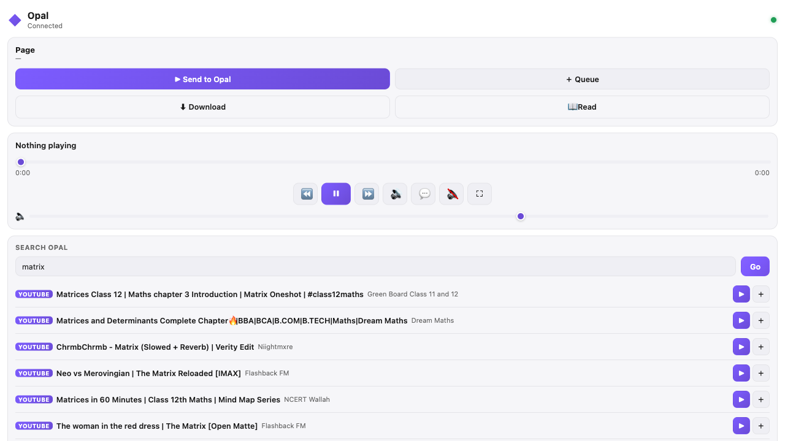

# Opal Connect — browser extension

A cross-browser (Chrome / Edge / Firefox, **Manifest V3**) companion for the
[Opal](../README.md) desktop app. It hands any website's media, articles,
downloads and — its headline trick — whole manga/novel **sites** to your
locally-running Opal, so link-sending feels native to the app instead of a
generic "open URL".

<div align="center">
  
  <sub><em>The side panel: connection status, page actions, transport, and a cross-source search — all driving a local Opal.</em></sub>
</div>

## What it does

- **Add this site as an Opal source** — on a recognised manga/novel site it detects
  the framework (Madara, MangaThemesia, HeanCMS, LightNovel-WP, ReadWN) and installs
  it as an Opal source in one click, searchable in Comics / Novels immediately.
- **Smart typed send** — the current page/link is classified (video / manga / novel /
  anime / magnet / media / article) and sent with a type hint so Opal routes it right.
  Right-click menus adapt ("Read chapter in Opal", "Play episode in Opal", …), with
  title, cover and chapter label scraped for a proper now-playing card.
- **Full side-panel remote** — the toolbar icon opens a persistent panel (Chrome/Edge)
  or sidebar (Firefox) that drives *all* of Opal:
  - **Search** every source (torrents, TMDB, YouTube, anime, Jellyfin) and play or
    queue a result inline.
  - **Transport** — play/pause, ±10s, seek, volume, mute, fullscreen, next audio/sub.
  - **Queue** — view it live and reorder items.
  - **Torrents** — live progress, rate and seed count for anything downloading,
    so a magnet you sent from the browser does not vanish into the app.
  - **Downloads** — browse the finished-downloads folder on the Opal machine and
    play a file straight from it.
  - **Continue watching** — recently played, one click to resume.
  - **Cast & watch-party** — find cast targets, stop casting, host/join/leave a
    LAN party with live peer status.
- **Queue / Download / Read** — queue a link, hand a URL to Opal's downloader, or
  extract readable article text.
- **Keyboard shortcuts** — <kbd>Alt+Shift+O</kbd> sends the current page,
  <kbd>Alt+Shift+P</kbd> play/pauses, without opening the panel.

Built with [extension.js](https://extension.js.org) (v3) + TypeScript.

## Install (prebuilt)

Grab a build from the [latest release](../../../releases/latest) — the assets are
`opal-connect-<ver>-chrome.zip` and `opal-connect-<ver>-firefox.zip`.

- **Chrome / Edge**: unzip, then `chrome://extensions` → *Developer mode* →
  *Load unpacked* → pick the unzipped folder.
- **Firefox**: `about:debugging` → *This Firefox* → *Load Temporary Add-on* →
  pick the zip (unsigned add-ons load per-session until signed on AMO).

Then connect it — see *First run* below.

## Requirements

- **Opal must be running locally** with the JSON API enabled
  (Opal → *Settings → Web Remote*). The extension talks to
  `http://127.0.0.1:41595` by default.
- Node 18+ to build (`npm install` pulls `extension` + `typescript`).

## First run

Setup opens by itself the first time the extension is installed, and is two steps:

1. **Search for Opal** — probes `/health` on the usual local addresses and fills
   in whatever answers. Nothing to type if Opal is on the same machine.
2. **Sign in** — the account you made in Opal. If that Opal has no account yet
   (a fresh headless box), step 2 offers to create the first one instead. The
   session token is stored via `chrome.storage.sync`; you never see it.

Opal on another machine: open *It's on another machine*, type host and port. A
non-loopback address needs one extra browser permission, which the extension
requests when you press Connect (Firefox grants `optional_host_permissions` from
127; older builds are loopback-only).

**Automation / advanced**: *Use an API token instead* takes the bearer token Opal
writes on first launch (mode `0600`) at `~/.config/opal/api.token` (macOS/Linux)
or `%APPDATA%\opal\api.token` (Windows). That is the same token scripts use.

> The extension never fetches localhost from a web page. Every Opal request is
> made by the background service worker, which holds `host_permissions` for
> `127.0.0.1`/`localhost` — so it isn't subject to page CORS, and Opal needs no
> CORS change.

## Develop (load unpacked)

```sh
cd extension
npm install
npm run dev        # extension.js dev server + auto-reload (Chrome)
npm run build      # → dist/  (load unpacked, or zip for distribution)
npx tsc --noEmit   # typecheck only
```

Then load it:

- **Chrome / Edge**: `chrome://extensions` → *Developer mode* → *Load unpacked* →
  pick `extension/dist/chrome`. Click the toolbar icon to open the side panel.
- **Firefox**: `about:debugging` → *This Firefox* → *Load Temporary Add-on* →
  pick `manifest.json` in the Firefox bundle. The panel opens as a sidebar.

## Supported actions & endpoints

All bearer-authed against Opal (`src/services/remote.zig`). The full action → endpoint
map lives in `src/shared.ts` (`OpalAction`).

| Group      | Endpoints                                                                                   |
| ---------- | ------------------------------------------------------------------------------------------- |
| Send       | `POST /api/open` · `/api/ingest` · `/api/load` · `/api/download/url` (all `?url=&…`)         |
| Sources    | `POST /api/source/add?framework=&base=`                                                      |
| Search     | `GET /api/unified_search?q=` · `/api/search?q=` · `/api/recommendations`                     |
| Transport  | `POST /api/playpause` · `/api/fwd` · `/api/back` · `/api/seek_pct?v=` · `/api/volume?v=` · `/api/vol_up` · `/api/vol_down` · `/api/mute` · `/api/fullscreen` · `/api/flip` · `/api/rotate` · `/api/next_audio` · `/api/next_sub` |
| Status     | `GET /api/status`                                                                            |
| Queue      | `GET /api/queue` · `POST /api/queue/move?idx=&dir=up\|down`                                   |
| Downloads  | `GET /api/downloads?dir=` · `POST /api/downloads/play?file=`                                  |
| Torrents   | `GET /api/torrents`                                                                          |
| History    | `GET /api/history`                                                                           |
| Cast/party | `GET /api/cast/devices` · `POST /api/cast/start` · `/api/cast/stop` · `POST /api/party/host` · `/api/party/join?ip=` · `/api/party/leave` · `GET /api/party/status` |
| Setup      | `GET /health` · `GET /api/auth/status` · `POST /api/auth/login` · `/api/auth/register` — the only unauthenticated ones; they are how the extension obtains a token |

`type` for `/api/ingest` is one of
`video｜manga｜novel｜anime｜magnet｜media｜article｜chapters｜queue`.
`framework` for `/api/source/add` is one of
`madara｜mangathemesia｜heancms｜madara_novel｜lightnovelwp｜readwn`.

## Files

```
extension/
├── manifest.json          MV3 manifest (side_panel + sidebar_action, no popup)
├── src/
│   ├── background.ts       service worker — the only place that talks to Opal
│   ├── content.ts          framework detection + page classify + shadow-DOM button
│   ├── shared.ts           settings + types shared across contexts
│   ├── sidepanel/          persistent panel: remote + send + add-source + recent
│   └── options/            setup wizard + settings (Connect / Behavior / Shortcuts / About)
└── public/images/          extension icons (public/ is flattened onto the
                            build output root, so pages can use /images/…)
```

## Caveats

- The floating **◆ Opal** button appears only when the content script finds
  something worth sending or a source to add; heavily-sandboxed pages block
  content scripts entirely.
- Madara serves both manga and novels; the extension guesses manga vs novel from
  the reading surface (image chapters vs prose). If it picks wrong, use the side
  panel's type to override.
- Watch-party and cast need the machines to see each other on the LAN; the panel
  reports the party role and peer count so a silent failure is visible.
